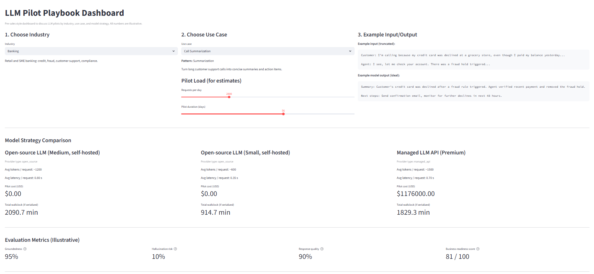

# LLM Pilot Playbook Dashboard

A small, opinionated dashboard for **LLM pilot conversations** between technical teams and business stakeholders.

Instead of calling real LLM APIs, this app uses **offline configs and simple estimators** to show how you would:

- Frame pilots by **industry** and **use case pattern** (RAG, summarization, classification)
- Compare **model strategies** (open-source vs managed API)
- Discuss **latency, cost, and evaluation metrics** in a way non-technical stakeholders can understand

---

## 🔍 Demo



---

## ✨ Key Features

- **Industry & Use Case Selection**
  - Choose an **industry** (Banking, Telco, Healthcare)
  - Choose a **use case** (Call Summarization, FAQ / Policy Q&A, Ticket Classification)
  - Each combination has curated example **inputs** and ideal **outputs**.

- **Model Strategy Comparison**
  - Compare hypothetical model options such as:
    - Open-source LLM (self-hosted, small/medium)
    - Managed LLM API (premium)
  - For each model, the dashboard shows:
    - Estimated **tokens per request**
    - Average **latency per request**
    - Estimated **pilot cost (USD)** for a chosen load
    - Estimated **total wallclock time** for all requests (serialized upper bound)

- **Evaluation Metrics (Offline, Mocked)**
  - Illustrative metrics for each industry/use-case combo:
    - **Groundedness**
    - **Hallucination risk**
    - **Response quality**
  - A combined **Business Readiness Score** using a simple, documented heuristic.

- **LLM Ready, No API Calls**
  - All data is local and configuration-driven.
  - The code clearly shows where real LLM calls, logging, and evaluation could plug in.

- **Basic SDLC Practices**
  - Separated **domain**, **estimators**, **evaluation**, and **UI** modules.
  - **Unit tests** using `pytest`.
  - **GitHub Actions CI** to run tests on pushes/PRs.

---

## 🏗 Architecture Overview

This project is intentionally small, but structured like a real app:

- **`app.py`** – Streamlit UI (selection widgets, metrics, layout)
- **`domain.py`** – Core dataclasses:
  - `Industry`, `UseCase`, `ModelOption`, `PilotScenario`
- **`data_examples.py`** – Offline “knowledge base”:
  - Industry and use case definitions
  - Curated example inputs/outputs
  - Baseline evaluation metrics per scenario
  - Model option configs (tokens, latency, cost assumptions)
- **`estimators.py`** – Cost and latency estimators:
  - `ScenarioLoad` (requests/day × days)
  - Functions to estimate cost, per-request latency, total wallclock time
- **`evaluation.py`** – Simple heuristic scoring:
  - Combines groundedness, hallucination risk, and response quality into a single 0–1 score
- **`tests/`** – Unit tests for estimators and evaluation logic
- **`.github/workflows/ci.yml`** – GitHub Actions pipeline to run `pytest`

This separation makes it easy to extend the project and talk about it like a real product (not just a quick script).

---

## 🚀 Getting Started

### 1. Clone the repository

```bash
git clone https://github.com/<your-username>/llm-pilot-playbook-dashboard.git
cd llm-pilot-playbook-dashboard
```

### 2. Create and activate a virtual environment (recommended)

```bash
python -m venv .venv
source .venv/bin/activate      # Linux/macOS
# or
.\.venv\Scripts\activate       # Windows (PowerShell)
```

### 3. Install dependencies

```bash
pip install --upgrade pip
pip install -r requirements.txt
```

### 4. Run the app

```bash
streamlit run app.py
```

Streamlit will print a local URL, typically:

* `http://localhost:8501`

Open it in your browser and explore the dashboard.

### 5. Run the tests

```bash
pytest
```

---

## 📊 How the Estimates Work

The numbers shown in the dashboard are **illustrative**, but they’re computed using simple, transparent formulas:

### Load model

A `ScenarioLoad` represents the pilot load:

```python
requests_per_day = 1000
days = 30
total_requests = requests_per_day * days
```

### Cost estimate

For each `ModelOption`:

```python
total_tokens = total_requests * est_tokens_per_request
cost_usd = (total_tokens / 1000) * est_cost_per_1k_tokens_usd
```

* **Open-source models**: `est_cost_per_1k_tokens_usd = 0.0`

  * You can explain that infra cost would be separate.
* **Managed APIs**: non-zero cost to simulate pay-per-token billing.

### Latency and wallclock time

```python
avg_latency_s = est_latency_ms / 1000
total_wallclock_min = (avg_latency_s * total_requests) / 60
```

In a real system, you’d explain **concurrency** and how parallelization reduces actual wallclock time.

---

## ✅ Evaluation Heuristic

For each `(industry, use_case)` combination, `BASELINE_METRICS` in `data_examples.py` defines:

* `groundedness` (0–1)
* `hallucination_risk` (0–1)
* `response_quality` (0–1)

The combined “business readiness” score is:

```python
score = 0.6 * groundedness + 0.3 * response_quality - 0.3 * hallucination_risk
score = clamp(score, 0, 1)
```

---

## 🔌 Where Real LLMs Would Plug In

This project is deliberately offline, but designed so you can easily add real models later:

* **RAG:**

  * Add a module (e.g., `rag_pipeline.py`) that:

    * Ingests documents
    * Builds embeddings
    * Runs retrieval + generation
  * Attach logs so you can compute groundedness metrics from real responses.

* **Summarization:**

  * Add a `summarize_call()` function calling a model via:

    * Hugging Face `transformers` (local or hosted)
    * A managed API (OpenAI, Azure OpenAI, watsonx, etc.)
  * Store evaluation results per use case.

* **Classification:**

  * Add a small labeled dataset of tickets or emails.
  * Compute **accuracy**, **precision/recall**, etc., and feed it into the dashboard.

Even without live models, this structure shows you understand how to design a **watsonx-style pilot** and how to have **value-focused conversations** about it.

---

## 🧪 Testing & CI

### Local tests

```bash
pytest
```

The tests cover:

* Correct behavior of `ScenarioLoad` and cost/latency estimators
* The evaluation heuristic (score range, penalty for hallucination risk, etc.)

### GitHub Actions

The repository includes a simple CI workflow at:

* `.github/workflows/ci.yml`

It runs `pytest` on pushes and pull requests for multiple Python versions.
In GitHub, you can enable a status badge and add it here, for example:

```markdown

```

---

## 🧱 Project Structure

```text
llm-pilot-playbook-dashboard/
  app.py                   # Streamlit UI
  domain.py                # Core dataclasses (Industry, UseCase, ModelOption, ...)
  estimators.py            # Cost and latency estimators
  evaluation.py            # Evaluation heuristic (groundedness, hallucination, quality)
  data_examples.py         # Industries, use cases, examples, baseline metrics, models
  requirements.txt
  pyproject.toml           # Optional metadata / pytest config
  doc/
    demo.png               # Screenshot used in README
  tests/
    test_estimators.py     # Unit tests for estimators
    test_evaluation.py     # Unit tests for evaluation logic
  .github/
    workflows/
      ci.yml               # GitHub Actions pipeline
```